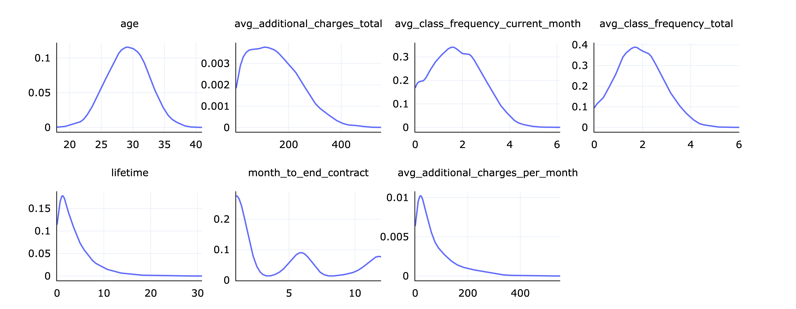
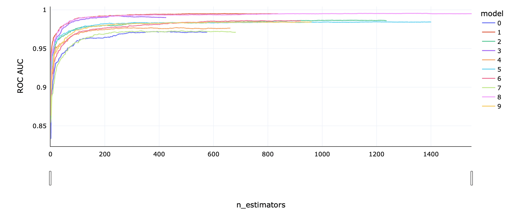
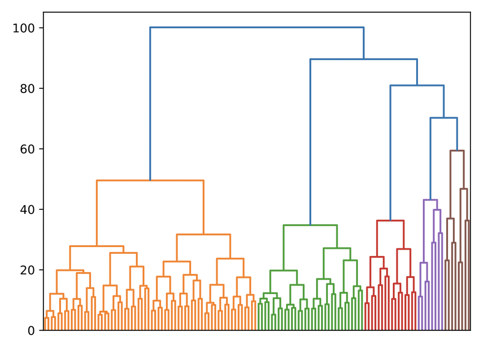
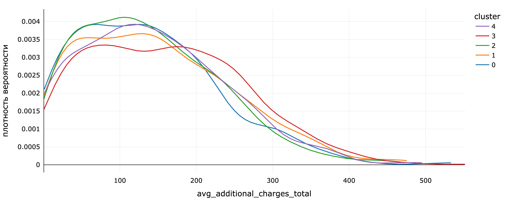

# Предсказание оттока клиентов фитнес-центра

Целью данного исследования является анализ и моделирование оттока клиентов фитнес-центра.

[Исследование](https://rusmux.ml/yandex-projects/10-fitness.html)

 

<h6 align="center">Распределение количественных признаков</h6>

 

<h6 align="center">Кросс-валидация LightGBM модели</h6>

 

<h6 align="center">Агломеративная кластеризация пользователей</h6>

 

<h6 align="center">Распределение дополнительных трат в разрезе по кластерам</h6>

  
 
**План:**

   <ul class="toc-item">
      <li><a href="#Предсказание-оттока-фитнес-центра" data-toc-modified-id="Предсказание-оттока-фитнес-центра-1">Предсказание оттока фитнес центра</a></li>
      <li><a href="#Setup" data-toc-modified-id="Setup-2">Setup</a></li>
      <li><a href="#Обработка-данных" data-toc-modified-id="Обработка-данных-3">Обработка данных</a></li>
      <li>
         <a href="#Исследовательский-анализ-данных" data-toc-modified-id="Исследовательский-анализ-данных-4">Исследовательский анализ данных</a>
         <ul class="toc-item">
            <li><a href="#Категориальные-признаки" data-toc-modified-id="Категориальные-признаки-4.1">Категориальные признаки</a></li>
            <li><a href="#Числовые-признаки" data-toc-modified-id="Числовые-признаки-4.2">Числовые признаки</a></li>
            <li><a href="#Целевая-переменная" data-toc-modified-id="Целевая-переменная-4.3">Целевая переменная</a></li>
            <li><a href="#Корреляции" data-toc-modified-id="Корреляции-4.4">Корреляции</a></li>
            <li><a href="#Вывод" data-toc-modified-id="Вывод-4.5">Вывод</a></li>
         </ul>
      </li>
      <li>
         <a href="#Моделирование-оттока" data-toc-modified-id="Моделирование-оттока-5">Моделирование оттока</a>
         <ul class="toc-item">
            <li>
               <a href="#Базовые-модели-(baseline)" data-toc-modified-id="Базовые-модели-(baseline)-5.1">Базовые модели (baseline)</a>
               <ul class="toc-item">
                  <li><a href="#Логистическая-регрессия" data-toc-modified-id="Логистическая-регрессия-5.1.1">Логистическая регрессия</a></li>
                  <li><a href="#Случайный-лес" data-toc-modified-id="Случайный-лес-5.1.2">Случайный лес</a></li>
                  <li><a href="#Градиентный-бустинг" data-toc-modified-id="Градиентный-бустинг-5.1.3">Градиентный бустинг</a></li>
               </ul>
            </li>
            <li><a href="#LightGBM" data-toc-modified-id="LightGBM-5.2">LightGBM</a></li>
            <li><a href="#Вывод" data-toc-modified-id="Вывод-5.3">Вывод</a></li>
         </ul>
      </li>
      <li><a href="#Кластеризация-пользователей" data-toc-modified-id="Кластеризация-пользователей-6">Кластеризация пользователей</a></li>
      <li><a href="#Итог" data-toc-modified-id="Итог-7">Итог</a></li>
   </ul>

 

**Итог:**

Была дана информация о клиентах фитнес-центра и их оттоке. В данных не было пропусков и дубликатов, а так же не нашлось аномалий.

*Клиенты*

* Наши клиенты — это примерно в равной пропорции сотрудники компаний-партнеров клуба, и просто люди в возрасте 25-35 лет, которые живут или работают поблизости. Большинство из них только пришли к нам, хотят попробовать, и берут абонемент на 1 месяц. Среднее время жизни клиента — 4-5 месяцев. Клиенты, которые уходят, делают это обычно в течении первых 2 месяцев. До ухода у этих клиентов снижена активность в зале — они посещают его в среднем 1 раз в неделю, в то время как остальные 2 раза в неделю.

*Моделирование оттока*

* Для моделирования оттока лучше всего подходит градиентный бустинг. Среди обученных моделей он показал себя лучше всех с качеством ROC AUC ~0.98. Обе имплементации Scikit-learn и LightGBM дали примерно один и тот же результат, только модель LightGBM обучается примерно в 10 раз быстрее. При подборе гиперпараметров, качество меняется уже в 3 знаке после запятой, то есть в долях процента, так что, скорее всего, это предельная точность для этой задачи, и нет смысла проводить тщательный отбор гиперпараметров с инструментами по типу Optuna.    Самыми главными признаками для моделей являются частота посещения зала в текущем месяце и общая, лайфтайм и возраст. Остальные признаки почти не меняют результаты предсказания.

*Кластеризация*

&emsp; Кластеризация выявила 5 основных кластеров клиентов:

* 
В 0-м кластере клиенты, которые живут далеко и склоны к уходу.

* 
У 1-го кластера низкий уровень оттока клиентов, но не самая высокая средняя длительность абонемента. Возможно, это клиенты, которые только пришли.

* 
У 2-го кластера самый высокий отток пользователей и самая низкая средняя длительность абонемента.

* 
В 3-м кластере у почти всех клиентов абонемент на год, а также самый низкий отток пользователей. Это кластер с самыми долгосрочными клиентами.

* 
В 4-м кластере у всех клиентов отсутствует телефон.

&emsp; Самыми надежными получаются кластеры 3 и 1, однако клиенты 1 кластера могут постепенно перейти во 2-й кластер. 

&emsp; Самым ненадежными являются клиенты 2-го и 0-го кластера.

*Рекомендации*

* Удержать клиентов, которые далеко живут, весьма непросто. Если есть возможность, можно открыть дополнительные филиалы в разных районах города.

* Для клиентов, которые только пришли (клиенты 1-го кластера), можно давать различные скидки и предложения, чтобы они не переставали заниматься, и не переходили во второй 2 кластер.

* Для клиентов 2-го кластера можно подойти более индивидуально и узнать, почему именно они уходят: нет времени, неудобный график, слишком далеко, или по другим причинам. В зависимости от их причин, можно давать более индивидуальные предложения.

* Клиентам 3-го кластера можно давать различные поощрения за лояльность к клубу. Это повысит их вовлеченность, и поможет увеличить шансы, что они порекомендуют наш фитнес-центр другим людям.

 

**Структура данных:**

Информация о клиентах фитнес-центра и их оттоке хранится в файле `gym_churn.csv`:

* `gender` — пол

* `Near_Location` — проживание или работа в районе, где находится фитнес-центр

* `Partner` — сотрудник компании-партнера клуба

* `Promo_friends` — был приглашен в рамках акции "приведи друга"

* `Phone` — указан мобильный телефон

* `Contract_period` — длительность текущего абонемента в месяцах

* `Group_visits` — факт посещения групповых занятий

* `Age` — возраст

* `Avg_additional_charges_total` — суммарные затраты на остальные услуги фитнес-центра: кофе, спорттовары и т. п.

* `Month_to_end_contract` — количество месяцев до окончания текущего абонемента

* `Lifetime` — количество месяцев с первой записи в фитнес-центр

* `Avg_class_frequency_total` — средняя частота посещений в неделю за все время с момента первой записи

* `Avg_class_frequency_current_month` — средняя частота посещений в неделю за предыдущий месяц

* `Churn` — факт ухода клиента
