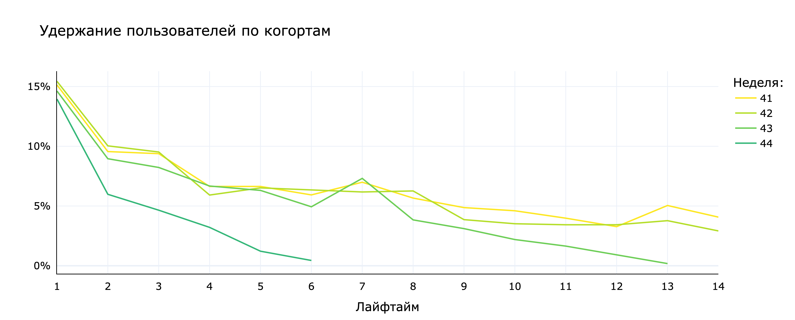
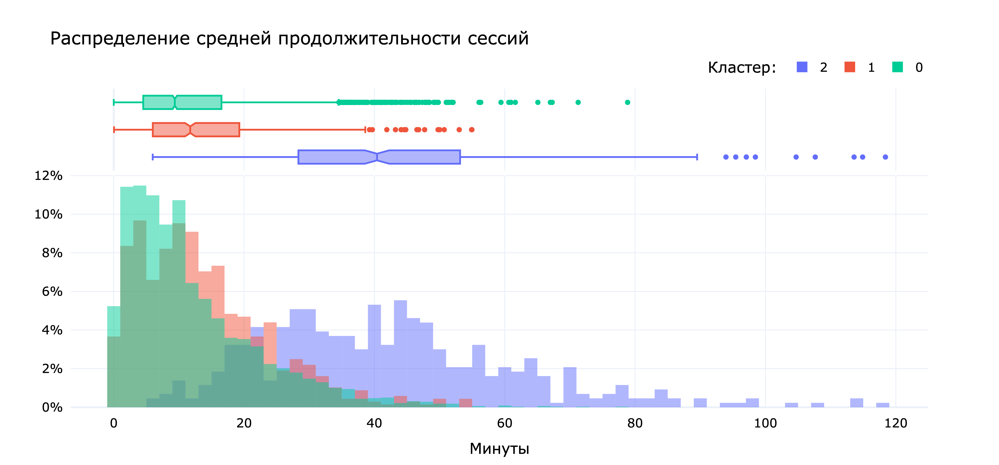
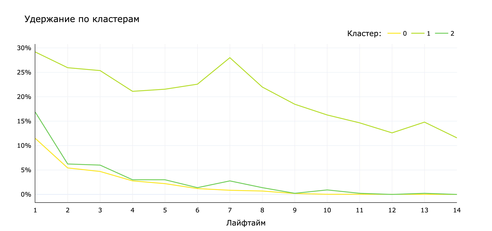

# Сегментация пользователей приложения "Ненужные вещи"

Целью данного исследования является выделить группы пользователей приложения "Ненужные вещи" на основе их поведения и посмотреть, как группы отличаются по:

* Удержанию

* Конверсии в целевое действие (просмотр контактов)

* Времени, проводимом в приложении

[Исследование](https://rusmux.github.io/yandex-projects/mobile.html)

[Презентация по исследованию](Yandex.Mobile.pdf)

 

**План:**

    <ul class="toc-item">
        <li><a href="#Setup" data-toc-modified-id="Setup-2">Setup</a></li>
        <li>
            <a href="#Предобработка-данных" data-toc-modified-id="Предобработка-данных-3">Предобработка данных</a>
            <ul class="toc-item">
                <li><a href="#Проверка-на-пропуски" data-toc-modified-id="Проверка-на-пропуски-3.1">Проверка на пропуски</a></li>
                <li><a href="#Преобразование-типов-данных" data-toc-modified-id="Преобразование-типов-данных-3.2">Преобразование типов данных</a></li>
                <li><a href="#Проверка-на-дубликаты" data-toc-modified-id="Проверка-на-дубликаты-3.3">Проверка на дубликаты</a></li>
                <li><a href="#Объединение-таблиц" data-toc-modified-id="Объединение-таблиц-3.4">Объединение таблиц</a></li>
                <li><a href="#Выводы-по-предобработке-данных" data-toc-modified-id="Выводы-по-предобработке-данных-3.5">Выводы по предобработке данных</a></li>
            </ul>
        </li>
        <li>
            <a href="#Исследовательский-анализ-данных" data-toc-modified-id="Исследовательский-анализ-данных-4">Исследовательский анализ данных</a>
            <ul class="toc-item">
                <li><a href="#Распределение-пользователей-по-источникам" data-toc-modified-id="Распределение-пользователей-по-источникам-4.1">Распределение пользователей по источникам</a></li>
                <li>
                    <a href="#События" data-toc-modified-id="События-4.2">События</a>
                    <ul class="toc-item">
                        <li><a href="#Общие-распределения" data-toc-modified-id="Общие-распределения-4.2.1">Общие распределения</a></li>
                        <li><a href="#Распределение-по-времени" data-toc-modified-id="Распределение-по-времени-4.2.2">Распределение по времени</a></li>
                    </ul>
                </li>
                <li>
                    <a href="#Удержание-пользователей" data-toc-modified-id="Удержание-пользователей-4.3">Удержание пользователей</a>
                    <ul class="toc-item">
                        <li><a href="#Создание-лайфтаймов" data-toc-modified-id="Создание-лайфтаймов-4.3.1">Создание лайфтаймов</a></li>
                        <li><a href="#Общее-удержание" data-toc-modified-id="Общее-удержание-4.3.2">Общее удержание</a></li>
                        <li><a href="#Удержание-по-источнику" data-toc-modified-id="Удержание-по-источнику-4.3.3">Удержание по источнику</a></li>
                        <li><a href="#Удержание-по-когортам" data-toc-modified-id="Удержание-по-когортам-4.3.4">Удержание по когортам</a></li>
                    </ul>
                </li>
                <li>
                    <a href="#Сессии" data-toc-modified-id="Сессии-4.4">Сессии</a>
                    <ul class="toc-item">
                        <li><a href="#Создание-сессий" data-toc-modified-id="Создание-сессий-4.4.1">Создание сессий</a></li>
                        <li><a href="#Количество-событий-за-сессию" data-toc-modified-id="Количество-событий-за-сессию-4.4.2">Количество событий за сессию</a></li>
                        <li><a href="#Количество-сессий-на-пользователя" data-toc-modified-id="Количество-сессий-на-пользователя-4.4.3">Количество сессий на пользователя</a></li>
                        <li><a href="#Продолжительность-сессий" data-toc-modified-id="Продолжительность-сессий-4.4.4">Продолжительность сессий</a></li>
                    </ul>
                </li>
                <li>
                    <a href="#Профили-пользователей" data-toc-modified-id="Профили-пользователей-4.5">Профили пользователей</a>
                    <ul class="toc-item">
                        <li><a href="#Создание-профилей-пользователей" data-toc-modified-id="Создание-профилей-пользователей-4.5.1">Создание профилей пользователей</a></li>
                        <li><a href="#Конверсия-в-просмотр-контактов" data-toc-modified-id="Конверсия-в-просмотр-контактов-4.5.2">Конверсия в просмотр контактов</a></li>
                        <li><a href="#Частоты-событий" data-toc-modified-id="Частоты-событий-4.5.3">Частоты событий</a></li>
                    </ul>
                </li>
                <li><a href="#Выводы-по-анализу-данных" data-toc-modified-id="Выводы-по-анализу-данных-4.6">Выводы по анализу данных</a></li>
            </ul>
        </li>
        <li>
            <a href="#Сегментация-пользователей" data-toc-modified-id="Сегментация-пользователей-5">Сегментация пользователей</a>
            <ul class="toc-item">
                <li><a href="#Предобработка-профилей-пользователей" data-toc-modified-id="Предобработка-профилей-пользователей-5.1">Предобработка профилей пользователей</a></li>
                <li><a href="#Сегментация" data-toc-modified-id="Сегментация-5.2">Сегментация</a></li>
                <li>
                    <a href="#Визуализация-кластеров" data-toc-modified-id="Визуализация-кластеров-5.3">Визуализация кластеров</a>
                    <ul class="toc-item">
                        <li><a href="#PCA" data-toc-modified-id="PCA-5.3.1">PCA</a></li>
                        <li><a href="#UMAP" data-toc-modified-id="UMAP-5.3.2">UMAP</a></li>
                    </ul>
                </li>
                <li>
                    <a href="#Статистики-кластеров" data-toc-modified-id="Статистики-кластеров-5.4">Статистики кластеров</a>
                    <ul class="toc-item">
                        <li><a href="#Удержание-пользователей" data-toc-modified-id="Удержание-пользователей-5.4.1">Удержание пользователей</a></li>
                        <li><a href="#Конверсия-в-просмотр-контактов" data-toc-modified-id="Конверсия-в-просмотр-контактов-5.4.2">Конверсия в просмотр контактов</a></li>
                        <li><a href="#Продолжительность-сессий" data-toc-modified-id="Продолжительность-сессий-5.4.3">Продолжительность сессий</a></li>
                    </ul>
                </li>
                <li><a href="#Выводы-по-сегментации" data-toc-modified-id="Выводы-по-сегментации-5.5">Выводы по сегментации</a></li>
            </ul>
        </li>
        <li>
            <a href="#Проверка-гипотез" data-toc-modified-id="Проверка-гипотез-6">Проверка гипотез</a>
            <ul class="toc-item">
                <li><a href="#Конверсия-в-просмотр-контактов-по-источнику" data-toc-modified-id="Конверсия-в-просмотр-контактов-по-источнику-6.1">Конверсия в просмотр контактов по источнику</a></li>
                <li><a href="#Конверсия-в-просмотр-контактов-по-кластеру" data-toc-modified-id="Конверсия-в-просмотр-контактов-по-кластеру-6.2">Конверсия в просмотр контактов по кластеру</a></li>
                <li><a href="#Выводы-по-проверке-гипотез" data-toc-modified-id="Выводы-по-проверке-гипотез-6.3">Выводы по проверке гипотез</a></li>
            </ul>
        </li>
        <li><a href="#Итог" data-toc-modified-id="Итог-7">Итог</a></li>
    </ul>

 

**Предобработка данных:**

Данные с 7 октября по 3 ноября 2019 года. Явных и неявных пропусков нет. Неявные дубликаты `contacts_show` и `show_contacts` были преобразованы к одному значению `contacts_show`. Было удалено 1.5% дублирующих друг друга событий.

 

**Исследовательский анализ данных:**

Всего ~15% пользователей зашли в наше приложение на второй день. Остальные могли просто скачать приложение, найти, что им нужно, и больше не заходить туда. Или наоборот, не найти и потерять интерес к приложению. Через неделю в приложение заходит 5% пользователей, а через 2 недели – 2%.

От источника удержание не зависит.

При разбиении пользователей на недельные когорты, образовалось 4 когорты: с 41 недели по 44. Удержание у пользователей, пришедших в 44 неделю, гораздо ниже, чем у остальных когорт. У когорт первых 3 недель примерно одинаковые удержания, хотя у когорты 43 недели удержание на 14 день сильно ниже, чем у когорт 41 и 42 недель.

Когорты не отличаются в распределениях событий на сессию. Распределение просмотренных фотографий и контактов не изменилось, что говорит о том, что удержание упало не из-за того, что приложение как-то изменилось. 

Когорты не отличаются по промежутку времени между событиями в сессиях. Это значит, что приложение не стало зависать или слишком медленно работать. Значит, падение удержания не связано с техническими проблемами.

Остается возможным то, что удержание уменьшилось из-за снижения популярности приложения.

В среднем, 20-25% пользователей посмотрело контакты. За 44 неделю самая низкая конверсия в просмотре контактов – 21%, на 3-4% меньше, чем у 41 и 43 недель.

У пользователей источников Google и Яндекс конверсия равна 24-25%, а у пользователей с других источников всего 19%.

 

**Сегментация пользователей:**

Кластеризация проводилась с помощью метода k-средних. 

В образовавшихся кластерах (0, 1, 2) присутствует большой дисбаланс количества пользователей. На кластер 0 приходится 74% всех пользователей, на 1-ый кластер 16%, а на 2-й только 11%.

У кластера 1 гораздо выше удержание — вероятно, это кластер с самыми лояльными пользователями. Кластеры 0 и 2 практически не отличаются по конверсии. Через неделю у 0-го кластера удержание равно 23%, а у кластеров 0 и 2 удержание равно ~1.5%.

У кластера 1 самая высокая конверсия в просмотр контактов – 37%. У кластера 2 конверсия равна 26%, а кластера 0 – 19%.

У 2-го кластера распределение средней продолжительности сессии отличается от первых двух кластеров. У кластеров 0 и 1 распределения экспоненциальные и совпадают, а вот у 2-го кластера распределение больше похоже на нормальное и сильно правее. Пользователи 2-го кластера проводят в приложении в среднем по 40 минут, в то время как пользователи первых двух кластеров – по 8-9.

Кластер 0 представляет большинство пользователей – 74% всех пользователей. В этом кластере ниже всего удержание и конверсия по сравнению с остальными кластерами.

Кластер 1 представляет самых лояльных пользователей – 16% всех пользователей. Здесь самые высокие удержание и конверсия в просмотр контактов.

Кластер 2 представляет пользователей, которые больше всего проводят времени в приложении – 10%. Здесь такое же удержание, как и у большинства пользователей, однако выше конверсия в просмотр контактов.

 

**Проверка гипотез:**

Было проверено 5 гипотез с помощью t-теста. Чтобы получить групповую вероятность ошибки первого рода меньше 0.05, к уровню значимости была применена поправка Шидака, что дало уровень значимости 0.01 для каждой гипотезы.

В результате проверки гипотез, можно сказать, что конверсии в просмотр контактов различаются между остальными источниками и источником Google/Яндекс. Между источниками Google и Яндекс статистически значимой разницы в конверсии нет.

Между всеми кластерами есть статистически значимая разница в конверсии в просмотр контактов.

 

**Рекомендации:**

Если популярность приложения падает, то можно увеличить количество рекламы и источников пользователей. На рынке присутствуют другие торговые площадки – возможно, пользователи уходят к ним. Стоит посмотреть, что предлагают конкуренты.

По возможности увеличить рекламу на источниках Google и Яндекс, так как у пользователей с этих источников конверсия выше на 6-7%.

Можно провести UX-интервью с пользователями кластеров 1 и 2 с целью понять, что мотивирует заходить их в приложение чаще и проводить в нем больше времени. Почему они выбирают именно наш продукт.

С пользователями кластера 0 тоже можно провести UX-интервью, чтобы понять почему они перестали пользоваться нашим приложением, или что заставило их перейти на другую торговую площадку.

 

**Структура данных:**

Данные об источниках установки приложения находятся в файле `mobile_sources.csv`:

* `UserId` – идентификатор пользователя

* `source` – источник, с которого пользователь установил приложение

Информация о действиях клиентов в приложении содержится в файле `mobile_dataset.csv`:

* `event.time` – время совершения события

* `event.name` – название события

* `user.id` – идентификатор пользователя

**Обозначения событий:**

* `advert_open` — открытие карточки объявления

* `photos_show` — просмотр фотографий в объявлении

* `tips_show` — пользователь увидел рекомендованные объявления

* `tips_click` — пользователь перешел по рекомендованному объявлению

* `contacts_show` и `show_contacts` — пользователь нажал на кнопку "посмотреть номер телефона" на карточке объявления

* `contacts_call` — пользователь позвонил по номеру на карточке объявления

* `map` — пользователь открыл карту размещенных объявлений

* `search_[1-7]` — разные действия, связанные с поиском по сайту

* `favorites_add` — добавление объявления в избранное

