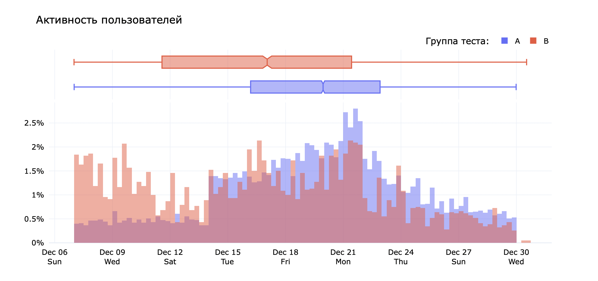
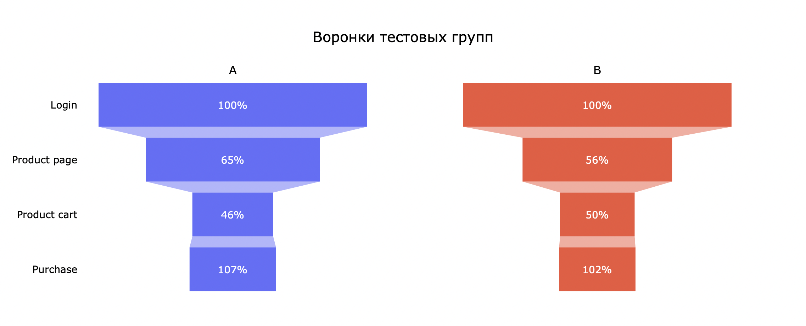
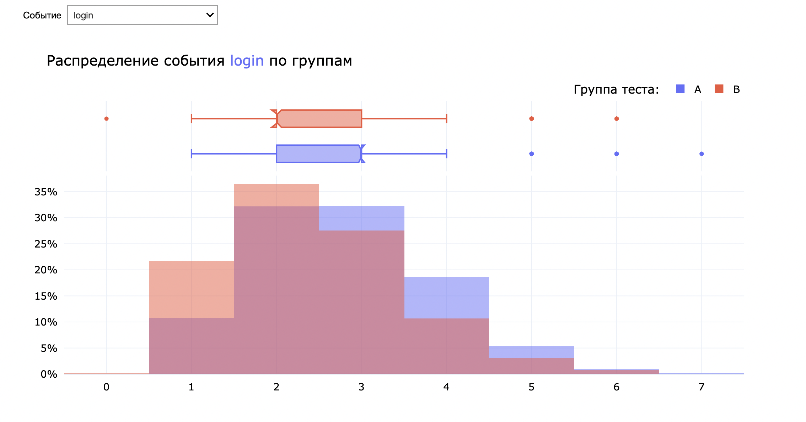

# A/B тестирование рекомендательной системы

Целью данного исследования является провести анализ результатов A/B-теста:

* Оценить корректность проведения теста

* Проанализировать результаты теста

[Исследование](https://rusmux.github.io/yandex-projects/12-ab-test.html)

**Описание теста:**

* Название теста: `recommender_system_test`;

* Группы: А — контрольная, B — новая платёжная воронка;

* Дата запуска: 2020-12-07;

* Дата остановки набора новых пользователей: 2020-12-21;

* Дата остановки: 2021-01-04;

* Аудитория: 15% новых пользователей из региона EU;

* Назначение теста: тестирование изменений, связанных с внедрением улучшенной рекомендательной системы;

* Ожидаемое количество участников теста: 6000;

* Ожидаемый эффект: за 14 дней с момента регистрации пользователи покажут улучшение каждой метрики не менее, чем на 10%:

    * конверсии в просмотр карточек товаров — событие `product_page`;
    
    * просмотры корзины — `product_cart`;
    
    * покупки — `purchase`;
    

 

**План:**

    <ul class="toc-item">
        <li><a href="#Setup" data-toc-modified-id="Setup-2">Setup</a></li>
        <li>
            <a href="#Предобработка-данных" data-toc-modified-id="Предобработка-данных-3">Предобработка данных</a>
            <ul class="toc-item">
                <li><a href="#Обработка-пропусков" data-toc-modified-id="Обработка-пропусков-3.1">Обработка пропусков</a></li>
                <li><a href="#Преобразование-типов-данных" data-toc-modified-id="Преобразование-типов-данных-3.2">Преобразование типов данных</a></li>
                <li><a href="#Обработка-дубликатов" data-toc-modified-id="Обработка-дубликатов-3.3">Обработка дубликатов</a></li>
                <li><a href="#Предобработка-пользователей" data-toc-modified-id="Предобработка-пользователей-3.4">Предобработка пользователей</a></li>
                <li><a href="#Итоги-предобработки" data-toc-modified-id="Итоги-предобработки-3.5">Итоги предобработки</a></li>
            </ul>
        </li>
        <li>
            <a href="#Исследовательский-анализ-данных" data-toc-modified-id="Исследовательский-анализ-данных-4">Исследовательский анализ данных</a>
            <ul class="toc-item">
                <li><a href="#Воронка-событий" data-toc-modified-id="Воронка-событий-4.1">Воронка событий</a></li>
                <li><a href="#Количество-событий-на-одного-пользователя" data-toc-modified-id="Количество-событий-на-одного-пользователя-4.2">Количество событий на одного пользователя</a></li>
                <li><a href="#Выручка-на-покупателя" data-toc-modified-id="Выручка-на-покупателя-4.3">Выручка на покупателя</a></li>
                <li><a href="#Итоги-по-анализу-данных" data-toc-modified-id="Итоги-по-анализу-данных-4.4">Итоги по анализу данных</a></li>
            </ul>
        </li>
        <li>
            <a href="#Проверка-гипотез" data-toc-modified-id="Проверка-гипотез-5">Проверка гипотез</a>
            <ul class="toc-item">
                <li><a href="#Конверсия-пользователей-в-покупатели" data-toc-modified-id="Конверсия-пользователей-в-покупатели-5.1">Конверсия пользователей в покупатели</a></li>
                <li><a href="#Выручка-на-пользователя" data-toc-modified-id="Выручка-на-пользователя-5.2">Выручка на пользователя</a></li>
            </ul>
        </li>
        <li><a href="#Итог" data-toc-modified-id="Итог-6">Итог</a></li>
    </ul>

 

**Описание данных:**

Вероятнее всего, данные неполные и в сборе данных присутствует ошибка. На это есть следующие причины:

* Последний зарегистрированный пользователь был 23 декабря, а последнее событие 30 декабря 2020 года, при том что в среднем в день регистрируется 3.5 тысячи новых пользователей и совершается 27 тысяч событий. Это может говорить о том, что данные неполные.

* Больше трети событий произошли одновременно – вероятно, ошибка в логировании.

* Среди пользователей, которые совершали действия, пользователей группы A в 3 раза больше, чем пользователей группы B. Причем это вряд ли влияние новой системы рекомендаций, так как она должна влиять только на пользователей, которые совершают действия.

* Пользователи группы B были активны до 15 декабря, а у пользователей группы A там минимальная активность.

Неполные данные могут поставить под сомнения корректность теста, так как с полными данными статистическая значимость теста может поменяться.

 

**Предобработка данных:**

Пропуски есть только в таблице `events` в столбце `details`, но они обозначают, что дополнительной информации о событии нет, так что они оставлены без изменений.

Кроме одновременных событий, дубликатов в данных нет.

Было отброшено 12% участников, так как они одновременно присутствовали в другом тесте. Еще 5% участников были не из стран Евросоюза. Среди оставшихся участников только половина совершала действия, причем 75% из них - пользователи группы А. Таким образом между группами присутствует большой дисбаланс в количестве участников, совершавших действия.

Кроме того, больше 30% пользователей группы B и больше 50% группы А зарегистрировались после 16 декабря 2020 года, и с момента их регистрации прошло меньше 14 дней. Если их отбросить, то от предполагаемых 6000 участников останется ~1700, то есть меньше 30%. Тогда, даже если между группами есть статистически значимая разница, статистический тест этого не покажет. Если их оставить, то рассматривать промежуток в 14 дней будет некорректно – конверсии могут не соответствовать реальным.

Оптимальным решением будет посмотреть, за какой промежуток времени в среднем пользователи конвертируются в покупателей. Если этот период меньше, чем 9 дней, тогда можно уменьшить рассматриваемый промежуток времени с 14 до 9 дней.

 

**Исследовательский анализ данных:**

Регистрация имеет цикличную активность и не зависит от устройства или группы пользователя. Больше всего пользователей регистрируется ближе к понедельнику и меньше всего в середине недели.

Практически половина пользователей заходят к нам с мобильных устройств Android. С компьютера заходят 25% пользователей, а с айфона 21%. С макбуков заходит меньше 10% пользователей.

Активность пользователей тоже неравномерна и сосредоточена вокруг 14-21 декабря. Возможно, в это время люди выбирали подарки к Новому году на нашем сайте. Однако эта активность выглядит весьма странно – резкий скачок активности почти в 3 раза 14 декабря и резкое снижение после 21 декабря. Также странно выглядит резкий обрыв активности после 29 декабря. Ближе к 30 декабря активность идет на убыль – вероятно, люди готовятся к Новому году.

Между устройствами сильной разницы нет, а вот распределение группы B отличается от распределения группы А. Пользователи группы B были активны и до 15 декабря, а у пользователей группы A там минимальная активность. Однако после 15 декабря у пользователей группы А выше активность. Возможно, у нас неполные данные для группы А, либо тут какая-то аномалия.

В среднем, если пользователи совершают покупку, то в первые 20 часов. Максимальный срок совершения покупки – 7 дней, что все равно меньше, чем 9 дней. Таким образом, можно сократить рассматриваемый промежуток с 14 дней до 9 дней. Если же оставлять 14 дней, то смысла что-либо проверять нет, потому что в группе B будет всего 450 пользователей, вместо предполагаемых 3000 тысяч.

У группы B значительно ниже доля тех, кто переходил на страницу продукта, но немного выше доля тех, кто потом перешел в корзину. Причем процент покупателей от тех, кто зашел в корзину, больше 100% – значит, покупку можно совершить и не заходя в корзину. Увеличение конверсии на 10% не наблюдается ни на одном из этапов воронки. Общая доля покупателей в группе B на 3% ниже, чем в группе А. 

Новый год мог повлиять на склонность пользователей к покупкам, но эта склонность присутствовала бы в обеих группах и новая система рекомендаций должна была бы только помочь людям быстрее купить подарки/вещи. Но мы наблюдаем только спад конверсии пользователей в покупателей.

Распределения количества событий на пользователя весьма похожи, но у группы B оно чуть смещено влево, то есть пользователи группы B делают чуть меньше событий, чем пользователи группы A.

Пользователи разных групп и разных устройств имеют примерно одинаковые распределения выручек. Однако распределение группы B немного левее, чем распределение группы А. Медиана для группы B равна 15\\$, а группы A - 20\\$.

 

**Проверка гипотез:**

Было проверено 3 гипотезы, есть ли между группами статистически значимая разница в конверсии пользователей на разных этапах воронки. Для проверки использовался t-тест с уровнем статистической значимости 0.01. 

Для перехода на страницу продукта p-значение достаточно мало, чтобы отвергнуть нулевую гипотезу и сказать, что конверсия перехода на страницу продукта между группами действительно отличается. Только не в пользу тестовой группы, так как у контрольной группы конверсия 65%, а у тестовой – 56%.

Для других этапов воронки p-значения слишком высокие, чтобы отвергать нулевые гипотезы. Это может быть прямым следствием того, что у нас слишком мало участников в группе B, и меньше предполагаемого количества в группе A.

В итоге получается, что новая система рекомендаций статистически значимо хуже в конверсии пользователей.

Также была проверена гипотеза, что средняя выручка с покупателя для групп A и B отличается. P-значение снова было слишком высоким, чтобы отвергнуть нулевую гипотезу.

 

**Итоги по тестированию:**

Для анализа теста были предоставлены данные низкого качества, а в организации теста присутствуют проблемы, описанные выше. Однако смысла проводить тест повторно, скорее всего, нет, так как тестовая группа не показала увеличения конверсии на 10% ни на одном из этапов воронки, а конверсия пользователей в просмотр товаров даже статистически хуже для тестовой группы. Также не изменилось количество событий на пользователя. Медианная выручка с покупателя у группы B на 5$ меньше, чем у группы А, но статистически значимой разницы обнаружено не было. Вероятнее всего, новая система рекомендаций действительно только понизила конверсию и среднюю выручку с покупателя, так что нет смысла продолжать ее тестировать.

 

**Структура данных:**

Календарь маркетинговых событий хранится в файле `ab_project_marketing_events.csv`:

* `name` – название маркетингового события;

* `regions` – регионы, в которых будет проводиться рекламная кампания;

* `start_dt` – дата начала кампании;

* `finish_dt` – дата завершения кампании;

Данные с пользователями, зарегистрировавшимися с 7 по 21 декабря 2020 года, находятся в файле `final_ab_new_users.csv`:

* `user_id` – уникальный идентификатор пользователя;

* `first_date` – дата регистрации;

* `region` – регион пользователя;

* `device` – устройство, с которого проходила регистрация;

Данные о действиях, совершенными новыми пользователями с 7 декабря 2020 по 4 января 2021 года, хранятся в файле `final_ab_events`:

* `user_id` – уникальный идентификатор пользователя;

* `event_dt` – дата и время покупки;

* `event_name` – тип действия;

* `details` – дополнительные сведения о действиях. Например, для события покупки `purchase` в этом поле хранится стоимость покупки в долларах.

Информация об участниках теста записана в файле `final_ab_participants`:

* `user_id` – уникальный идентификатор пользователя;

* `group` – группа пользователя;

* `ab_test` – название теста;