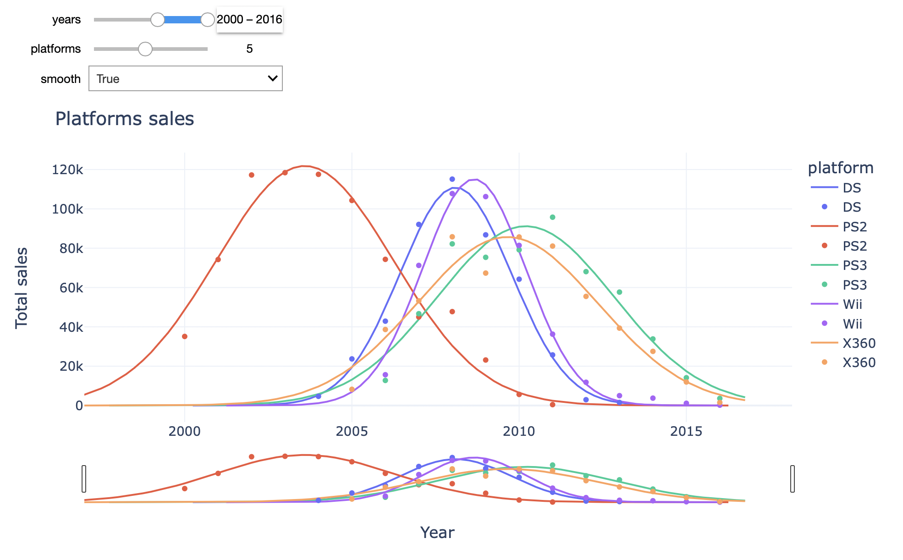
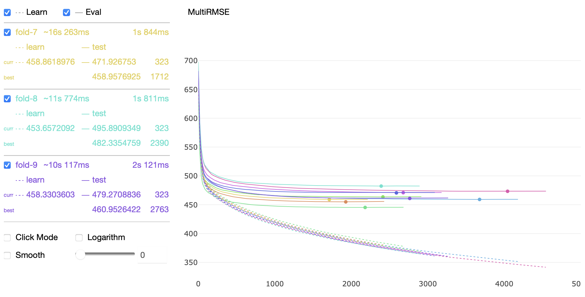
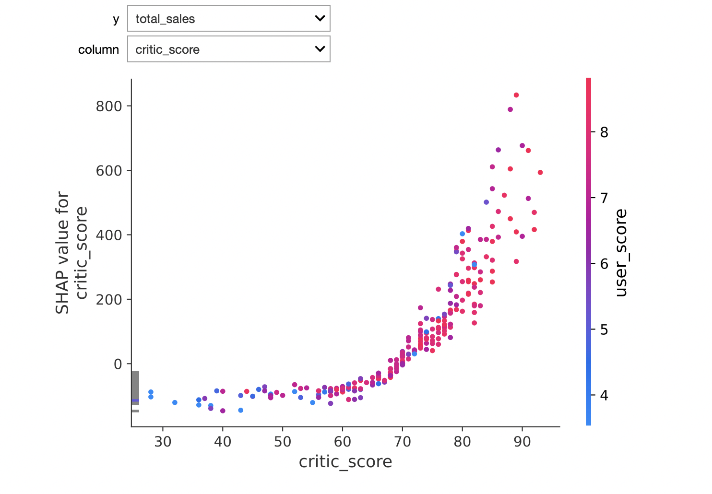

# Исследование рынка игр

Данное исследование ставит перед собой цели:

* Исследовать закономерности среди наиболее успешных игр

* Сравнить продажи среди разных платформ и жанров

* Определить наиболее сильные признаки успешных видеоигр

Это поможет сделать ставку на потенциально популярных играх и спланировать рекламные компании. 

Исследование базируется на исторических данных из открытых источников.

[Исследование](https://rusmux.github.io/yandex-projects/4-games.html)[^1]

Во время конвертации jupyter-ноутбука в веб-страницу не сконвертировались 2 графика.

[Jupyter-ноутбук](Yandex.Games.ipynb)

Ввиду большого веса ноутбук был сохранен без выводов.

 

<h6 align="center">Сглаживание динамики продаж нормальным распределением</h6> 

 

<h6 align="center">ShuffleSplit кросс-валидация модели мультирегрессии</h6> 

 

<h6 align="center">SHAP-значение оценки критиков для общих продаж</h6> 

 

**План:**

   <ul class="toc-item">
      <li><a href="#Setup" data-toc-modified-id="Setup-2">Setup</a></li>
      <li><a href="#Предобработка-данных" data-toc-modified-id="Предобработка-данных-3">Предобработка данных</a></li>
      <li><a href="#Исследовательский-анализ-данных" data-toc-modified-id="Исследовательский-анализ-данных-4">Исследовательский анализ данных</a></li>
      <li>
         <a href="#Тестирование-гипотез" data-toc-modified-id="Тестирование-гипотез-5">Тестирование гипотез</a>
         <ul class="toc-item">
            <li><a href="#Средние-пользовательские-рейтинги-платформ-Xbox-One-и-PC-одинаковые" data-toc-modified-id="Средние-пользовательские-рейтинги-платформ-Xbox-One-и-PC-одинаковые-5.1">Средние пользовательские рейтинги платформ Xbox One и PC одинаковые</a></li>
            <li><a href="#Средние-пользовательские-рейтинги-жанров-Action-и-Sports-разные." data-toc-modified-id="Средние-пользовательские-рейтинги-жанров-Action-и-Sports-разные.-5.2">Средние пользовательские рейтинги жанров Action и Sports разные.</a></li>
         </ul>
      </li>
      <li><a href="#Важность-признаков" data-toc-modified-id="Важность-признаков-6">Важность признаков</a></li>
      <li><a href="#Итог" data-toc-modified-id="Итог-7">Итог</a></li>
   </ul>

 

**Итог:**

Наиболее сильными признаками являются оценка критиков и платформа игры. За ними идут количество поддерживаемых платформ и жанр. Год выпуска, рейтинг и оценка пользователей мало влияют на продажи (продажи зависят от оценки пользователей, но оценка критиков лучше моделирует продажи, а оценка пользователей практически не привносит никакой новой информации).

*За все время*

* Оценка критиков начинает сильно положительно влиять на продажи только когда выше ~60.

* Самыми продаваемыми платформами являются PS2/3/4, X360/XOne и Wii. Хуже всего продаются компьютерные игры. Платформы в среднем живут 6-10 лет и пик продаж наступает на 3-5 год.

* Общие продажи снизились с 1980 года и последние 10 лет примерно одинаковы (относительно всего периода).

* Чем выше количество поддерживаемых платформ, тем больше продажи.

* Лучше всего продаются шутеры, платформеры и гонки, хуже всего - приключения, стратегии и пазлы.

* Чем выше оценка пользователей, тем выше продажи.

* Игры с рейтингом M продаются чуть лучше.

*За последние 5 лет*

* За последние 5 лет виден спад в продажах видеоигр.

* Почти все крупные платформы уже отжили свое, продажи растут только у новых консолей PS4 и XOne.

* Платформеры и гонки стали чуть хуже продаваться.

*По регионам*

Население Европы и Северной Америки имеют схожие вкусы. Они играют на современных настольных консолях в шутеры, гонки и платформеры. Предпочитают игры с рейтингом M или E10+. Японцы же играют в портативные консоли (PSP, PSV, 3DS), и играют в основном в ролевые игры, файтинг и стратегии. Для них предпочтительнее игры без рейтинга и игры с рейтингом T.

*Гипотезы*

* Не смогли отвергнуть нулевую гипотезу о том, что средние рейтинги платформ XOne и PC одинаковые.

* Показали, что вероятность, что средние пользовательские рейтинги жанров Action и Sports одинаковые - крайне мала. Мы принимаем альтернативную гипотезу о том, что средние рейтинги отличаются.

 

**Структура данных:**

Информация о продажах видеоигр хранится в файле `games_data.csv`:

* `Name` — название видеоигры

* `Platform` — платформа

* `Year_of_Release` — год выпуска

* `Genre` — жанр

* `NA_sales` — продажи в Северной Америке (миллионы проданных копий)

* `EU_sales` — продажи в Европе (миллионы проданных копий)

* `JP_sales` — продажи в Японии (миллионы проданных копий)

* `Other_sales` — продажи в других странах (миллионы проданных копий)

* `Critic_Score` — оценка критиков (максимум 100)

* `User_Score` — оценка пользователей (максимум 10)

* `Rating` — возрастной рейтинг от организации ESRB 

[^1]: Из-за использования различных средств визуализации, таких как `plotly` и `catboost.MetricVisualizer`, и комбинирования их с интерактивными виджетами `ipywidgets` jupyter-ноутбук нельзя было полноценно конвертировать в html-файл привычным образом через jupyter nbconvert — графики не отображались. Для переноса исследования на веб-страницу я сохранил jupyter-ноутбук в формате [webarchive](https://en.wikipedia.org/wiki/Webarchive), а дальше сконвертировал его в html-файл с помощью библиотеки [pywebarchive](https://github.com/bmjcode/pywebarchive).
