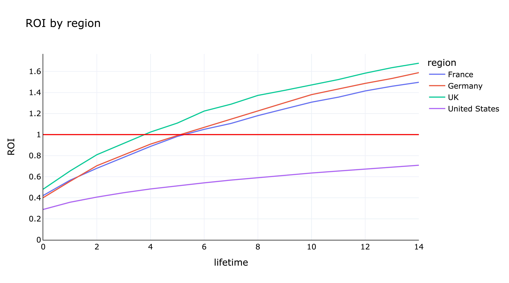
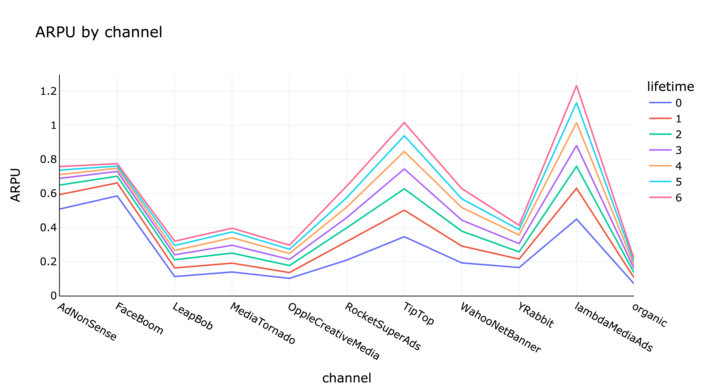
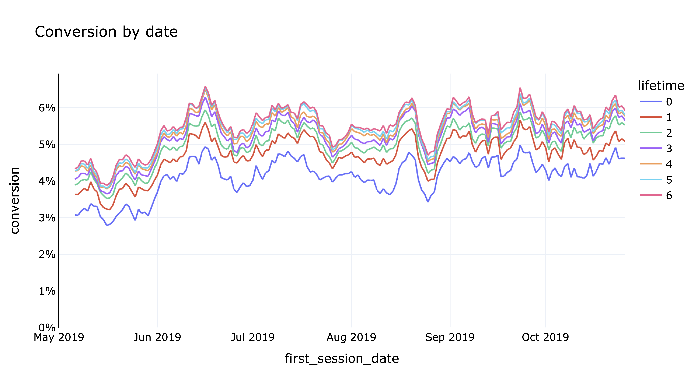
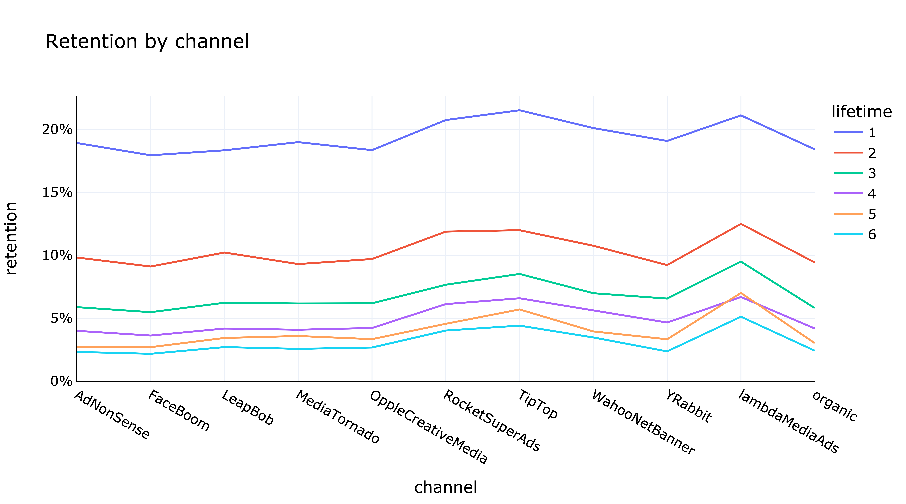
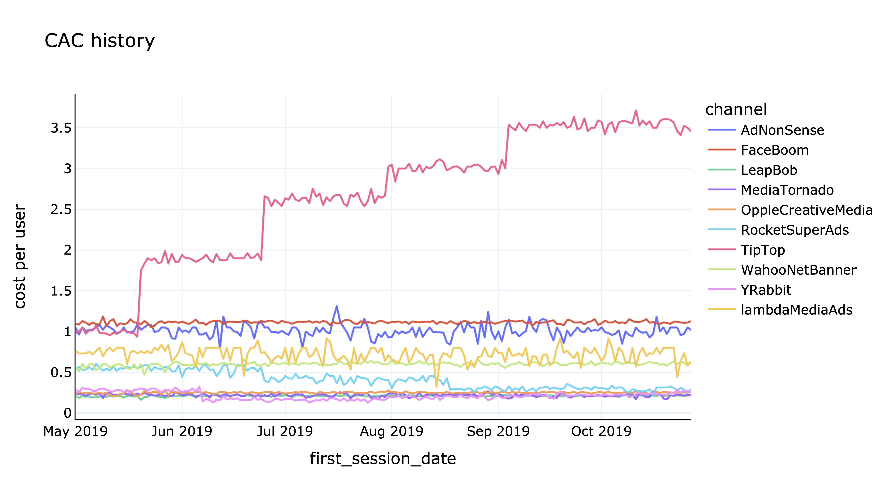

# Исследование убыточности компании Procrastinate Pro+

Целью данного исследования является определить причины, по которым развлекательное приложение Procrastinate Pro+ терпит
убытки последние месяцы.

Для этого есть информация о пользователях, привлеченных с 1 мая по 27 октября 2019 года:

* логи их посещений

* выгрузка заказов

* расходы на рекламу

[Исследование](https://rusmux.github.io/yandex-projects/5-metrics)

<h6 align="center">Разбиение ROI по регионам</h6>

<h6 align="center">ARPU первых 7 дней в срезе по рекламным каналам</h6>

<h6 align="center">Динамика конверсии по дате регистрации</h6>

<h6 align="center">Удержание по каналам в первые 7 дней</h6>

**План:**

   <ul class="toc-item">
      <li><a href="#Setup" data-toc-modified-id="Setup-2">Setup</a></li>
      <li><a href="#Предобработка-данных" data-toc-modified-id="Предобработка-данных-3">Предобработка данных</a></li>
      <li><a href="#Исследовательский-анализ-данных" data-toc-modified-id="Исследовательский-анализ-данных-4">Исследовательский анализ данных</a></li>
      <li>
         <a href="#Получение-профилей-пользователей" data-toc-modified-id="Получение-профилей-пользователей-5">Получение профилей пользователей</a>
         <ul class="toc-item">
            <li><a href="#CAC" data-toc-modified-id="CAC-5.1">CAC</a></li>
            <li><a href="#Устройства-по-регионам" data-toc-modified-id="Устройства-по-регионам-5.2">Устройства по регионам</a></li>
            <li><a href="#Каналы-по-регионам" data-toc-modified-id="Каналы-по-регионам-5.3">Каналы по регионам</a></li>
            <li><a href="#Покупатели-по-регионам" data-toc-modified-id="Покупатели-по-регионам-5.4">Покупатели по регионам</a></li>
            <li><a href="#Покупатели-по-устройству" data-toc-modified-id="Покупатели-по-устройству-5.5">Покупатели по устройству</a></li>
            <li><a href="#Покупатели-по-каналам" data-toc-modified-id="Покупатели-по-каналам-5.6">Покупатели по каналам</a></li>
         </ul>
      </li>
      <li>
         <a href="#Удержание-пользователей" data-toc-modified-id="Удержание-пользователей-6">Удержание пользователей</a>
         <ul class="toc-item">
            <li><a href="#Общее-удержание" data-toc-modified-id="Общее-удержание-6.1">Общее удержание</a></li>
            <li><a href="#Динамика-удержания" data-toc-modified-id="Динамика-удержания-6.2">Динамика удержания</a></li>
            <li><a href="#Удержание-по-региону" data-toc-modified-id="Удержание-по-региону-6.3">Удержание по региону</a></li>
            <li><a href="#Удержание-по-устройству" data-toc-modified-id="Удержание-по-устройству-6.4">Удержание по устройству</a></li>
            <li><a href="#Удержание-по-каналу-привлечения" data-toc-modified-id="Удержание-по-каналу-привлечения-6.5">Удержание по каналу привлечения</a></li>
            <li><a href="#Удержание-платящих-и-неплатящих-пользователей" data-toc-modified-id="Удержание-платящих-и-неплатящих-пользователей-6.6">Удержание платящих и неплатящих пользователей</a></li>
            <li><a href="#Выводы-по-удержанию" data-toc-modified-id="Выводы-по-удержанию-6.7">Выводы по удержанию</a></li>
         </ul>
      </li>
      <li><a href="#DAU,-WAU,-MAU" data-toc-modified-id="DAU,-WAU,-MAU-7">DAU, WAU, MAU</a></li>
      <li>
         <a href="#Конверсия" data-toc-modified-id="Конверсия-8">Конверсия</a>
         <ul class="toc-item">
            <li><a href="#Общая-конверсия" data-toc-modified-id="Общая-конверсия-8.1">Общая конверсия</a></li>
            <li><a href="#Динамика-конверсии" data-toc-modified-id="Динамика-конверсии-8.2">Динамика конверсии</a></li>
            <li><a href="#Конверсия-по-региону" data-toc-modified-id="Конверсия-по-региону-8.3">Конверсия по региону</a></li>
            <li><a href="#Конверсия-по-устройству" data-toc-modified-id="Конверсия-по-устройству-8.4">Конверсия по устройству</a></li>
            <li><a href="#Конверсия-по-каналу-привлечения" data-toc-modified-id="Конверсия-по-каналу-привлечения-8.5">Конверсия по каналу привлечения</a></li>
            <li><a href="#Выводы-по-конверсии" data-toc-modified-id="Выводы-по-конверсии-8.6">Выводы по конверсии</a></li>
         </ul>
      </li>
      <li>
         <a href="#ARPU" data-toc-modified-id="ARPU-9">ARPU</a>
         <ul class="toc-item">
            <li><a href="#Общий-ARPU" data-toc-modified-id="Общий-ARPU-9.1">Общий ARPU</a></li>
            <li><a href="#Динамика-ARPU" data-toc-modified-id="Динамика-ARPU-9.2">Динамика ARPU</a></li>
            <li><a href="#ARPU-по-региону" data-toc-modified-id="ARPU-по-региону-9.3">ARPU по региону</a></li>
            <li><a href="#ARPU-по-устройству" data-toc-modified-id="ARPU-по-устройству-9.4">ARPU по устройству</a></li>
            <li><a href="#ARPU-по-каналу-привлечения" data-toc-modified-id="ARPU-по-каналу-привлечения-9.5">ARPU по каналу привлечения</a></li>
            <li><a href="#Выводы-по-ARPU" data-toc-modified-id="Выводы-по-ARPU-9.6">Выводы по ARPU</a></li>
         </ul>
      </li>
      <li>
         <a href="#ROI" data-toc-modified-id="ROI-10">ROI</a>
         <ul class="toc-item">
            <li><a href="#Общий-ROI" data-toc-modified-id="Общий-ROI-10.1">Общий ROI</a></li>
            <li><a href="#Динамика-ROI" data-toc-modified-id="Динамика-ROI-10.2">Динамика ROI</a></li>
            <li><a href="#ROI-по-региону" data-toc-modified-id="ROI-по-региону-10.3">ROI по региону</a></li>
            <li><a href="#ROI-по-устройству" data-toc-modified-id="ROI-по-устройству-10.4">ROI по устройству</a></li>
            <li><a href="#ROI-по-каналу-привлечения" data-toc-modified-id="ROI-по-каналу-привлечения-10.5">ROI по каналу привлечения</a></li>
            <li><a href="#Выводы-по-ROI" data-toc-modified-id="Выводы-по-ROI-10.6">Выводы по ROI</a></li>
         </ul>
      </li>
      <li><a href="#Итог" data-toc-modified-id="Итог-11">Итог</a></li>
   </ul>

 

**Выводы:**

Были даны данные о сессиях пользователей, их заказах и расходах на рекламу. Пропусков и дубликатов в них не было, так
что предобрабатывать данные не пришлось.

*Общее*

* Больше половины сессий происходит из США, а самым популярным устройством является айфон.

* Чаще всего пользователи приходят сами, а из рекламных источников лидируют TipTop и FaceBoom.

*Удержание*

* Удержание за первые две недели снижается с 20% до 1% и не зависит от региона, устройства и даты регистрации.

* Выше всего удержание у каналов lambdaMediaAds, TipTop и RocketSuperAds. Ниже всего удержание у FaceBoom, AdNonSense и
  у органических пользователей.

*Конверсия*

* Почти все покупатели конвертируются за первые 14 дней, их количество составляет примерно 5% от всех пользователей.
  Тенденции по времени регистрации не наблюдается.

* В США конверсия почти в 2 раза выше, чем в остальных регионах.

* Среди устройств лучше всего конвертируются пользователи мака, хуже всего - PC.

* Выше всего конверсия у каналов FaceBoom, AdNonSense и lambdaMediaAds. Ниже всего у LeapBob, OppleCreativeMedia и у
  органических пользователей.

*Стоимость рекламы*

* Стоимость рекламы растет со временем, причем причиной этому, судя по всему, является CPA канала TipTop - в отличие от
  остальных каналов, они на протяжении всего года повышали стоимость своей рекламы.

**Причины убыточности:**

Приложение несет убытки из-за неокупаемости рекламы. Она идет с 3 каналов:

&emsp; **TipTop** - канал, в основном распространенный в США. Пользователи, пришедшие с этого канала, приносят высокую
выручку, но канал на протяжении всего года повышал стоимость своей рекламы, так что в итоге стоимость привлечения
клиентов сильно превышает выручку, что делает канал не рентабельным (на октябрь APRU 1.5 против CAC 3.5).

&emsp; **FaceBoom** - тоже канал, распространенный только в США. Покупатели, пришедшие с их рекламы, почему-то совершают
максимум 1-2 покупки, в то время как у остальных каналов клиенты делают по 6-7 покупок. У них так же относительно
немалая стоимость рекламы, поэтому она перевешивает выручку (на октябрь APRU 0.85 против CAC 1.11).

Оба этих канала приносят ~80% всех клиентов США и 60% всех клиентов. Нужно либо искать новые каналы, либо договориться о
снижении цены рекламы. У FaceBoom нужно выяснить, почему покупатели делают максимум 1-2 покупки - от устройства это не
зависит.

Без снижения цены рекламы сделать каналы прибыльными не получится, так как у канала TipTop и так одни из самых высоких
конверсия и удержание. У FaceBoom точка роста - попытаться увеличить удержание; на текущий момент у них одно из самых
низких удержаний (на 7 день 1.5% против 4% у канала TipTop).

&emsp; **AdNonSense** - малопопулярный европейский канал. Так же как и у FaceBoom покупатели делают максимум 1-2
покупки. Среди европейских каналов у них самая высокая цена привлечения клиентов (CAC 1 против 0.5 у остальных каналов).
Нужно разобраться, почему покупатели делают мало покупок, а также попытаться снизить цену на рекламу.

<h6 align="center">Динамика CAC по каналам</h6>

 

**Структура данных:**

Данные о сессиях пользователей хранит файл `visits_data.csv`:

* `User Id` - уникальный идентификатор пользователя

* `Region` - регион, из которого произведена сессия

* `Device` - устройство, с которого произведена сессия

* `Channel` - канал, с которого пришел пользователь

* `Session Start` - дата и время начала сессии

* `Session End` - дата и время окончания сессии

Информацию о заказах содержит файл `orders_data.csv`:

* `User Id` - уникальный идентификатор пользователя

* `Event Dt` - дата и время заказа

* `Revenue` - стоимость покупки

Расходы на рекламу записаны в файле `costs_data.csv`:

* `dt` - дата проведения рекламной компании

* `Channel` - рекламный канал

* `costs` - расходы на эту рекламу
