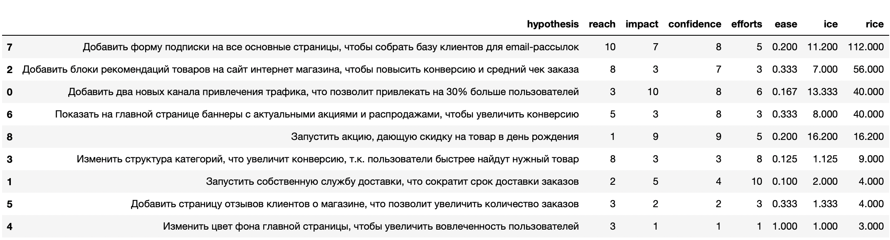
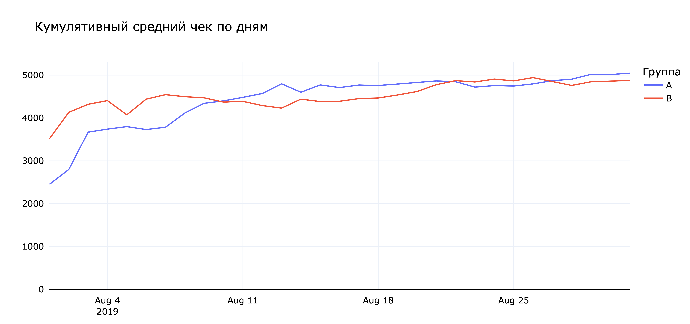
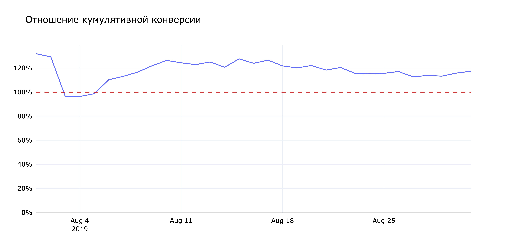

# Приоритизация гипотез и анализ A/B-теста

Этот проект состоит из 2 частей. В первой части с помощью фреймворков ICE и RICE из списка гипотез выбираются самые перспективные. Вторая часть представляет собой анализ проведенного A/B-теста.

[Проект](https://rusmux.github.io/yandex-projects/ab-test.html)

<h6 align="center">Расчет ICE и RICE значений для гипотез</h6>

**План:**

   <ul class="toc-item">
      <li><a href="#Setup" data-toc-modified-id="Setup-2">Setup</a></li>
      <li><a href="#Приоритизация-гипотез" data-toc-modified-id="Приоритизация-гипотез-3">Приоритизация гипотез</a></li>
      <li>
         <a href="#Анализ-A/B-теста" data-toc-modified-id="Анализ-A/B-теста-4">Анализ A/B теста</a>
         <ul class="toc-item">
            <li><a href="#Предобработка-данных" data-toc-modified-id="Предобработка-данных-4.1">Предобработка данных</a></li>
            <li>
               <a href="#Анализ-выручки" data-toc-modified-id="Анализ-выручки-4.2">Анализ выручки</a>
               <ul class="toc-item">
                  <li><a href="#Исследование-аномалий" data-toc-modified-id="Исследование-аномалий-4.2.1">Исследование аномалий</a></li>
                  <li><a href="#Выручка" data-toc-modified-id="Выручка-4.2.2">Выручка</a></li>
                  <li><a href="#Средний-чек" data-toc-modified-id="Средний-чек-4.2.3">Средний чек</a></li>
                  <li><a href="#Средний-доход-на-покупателя" data-toc-modified-id="Средний-доход-на-покупателя-4.2.4">Средний доход на покупателя</a></li>
               </ul>
            </li>
            <li><a href="#Анализ-конверсии" data-toc-modified-id="Анализ-конверсии-4.3">Анализ конверсии</a></li>
         </ul>
      </li>
      <li><a href="#Итог" data-toc-modified-id="Итог-5">Итог</a></li>
   </ul>

 

**Итог:**

На текущий момент видим, что:

* Кумулятивная выручка группы B на 10-20% выше, чем группы А, но статистическая разность не подтверждается

* Отношение средних чеков колеблется вокруг 1 и статистически значимой разницы нет

* Средний доход на покупателя тоже не сильно отличается

* Конверсия группы В статистически отличима от конверсии контрольной группы и на 15-25% ее выше, хотя в последнее время отношение идет на убыль

Несмотря на снижение отношения конверсий, я считаю, что можно прекращать эксперимент. Разницы между средними чеками нет, а конверсия на 15-25% выше у группы В.

<h6 align="center"></h6>

 

**Структура данных:**

Список гипотез для первой части находится в файле `hypothesis.csv`:

* `Hypothesis` - описание гипотезы

* `Reach` - охват пользователей по шкале от 1 до 10

* `Impact` - влияние на пользователей по шкале от 1 до 10

* `Confidence` - уверенность в гипотезе по шкале от 1 до 10

* `Efforts` - сложность реализации гипотезы по шкале от 1 до 10

Информация о пользователях в A/B-тесте содержится в файле `visitors.csv`:

* `date` - дата посещения

* `group` - группа теста (A или B)

* `visitors` - количество пользователей в указанную дату в указанной группе A/B-теста

Заказы пользователей в A/B-тесте находятся в файле `orders.csv`:

* `transactionId` - уникальный идентификатор заказа

* `visitorId` - уникальный идентификатор пользователя

* `date` - дата заказа

* `revenue` - выручка от заказа

* `group` - группа теста (A или B)
