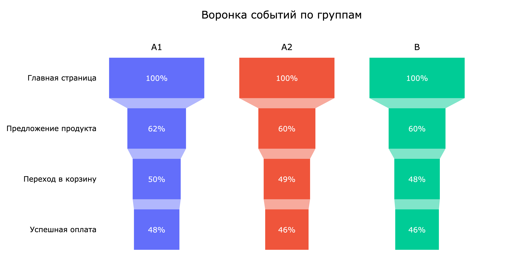
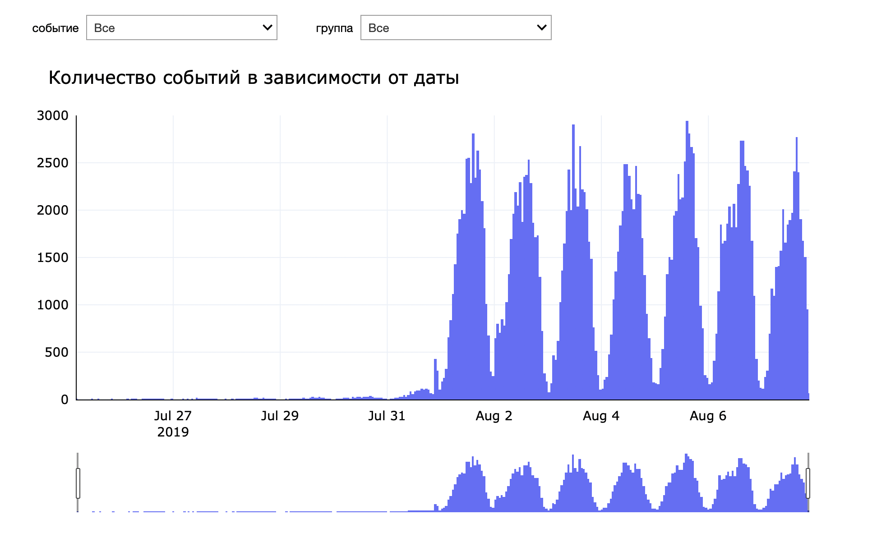

# Анализ результатов A/A/B-тестирования

Данное исследование представляет собой анализ результатов эксперимента, целью которого было проверить, не скажется ли смена шрифтов в приложении негативно на активности пользователей. Эксперимент проводился на базе A/A/B-тестирования.

[Исследование](https://rusmux.github.io/yandex-projects/8-aab-test.html)

 

**План:**

   <ul class="toc-item">
      <li><a href="#Setup" data-toc-modified-id="Setup-2">Setup</a></li>
      <li>
         <a href="#Предобработка-данных" data-toc-modified-id="Предобработка-данных-3">Предобработка данных</a>
         <ul class="toc-item">
            <li><a href="#Преобразование-типов-столбцов" data-toc-modified-id="Преобразование-типов-столбцов-3.1">Преобразование типов столбцов</a></li>
            <li><a href="#Удаление-дубликатов" data-toc-modified-id="Удаление-дубликатов-3.2">Удаление дубликатов</a></li>
            <li><a href="#Удаление-неполных-данных" data-toc-modified-id="Удаление-неполных-данных-3.3">Удаление неполных данных</a></li>
         </ul>
      </li>
      <li>
         <a href="#Анализ-результатов-эксперимента" data-toc-modified-id="Анализ-результатов-эксперимента-4">Анализ результатов эксперимента</a>
         <ul class="toc-item">
            <li><a href="#Воронки-событий" data-toc-modified-id="Воронки-событий-4.1">Воронки событий</a></li>
            <li><a href="#Количество-событий-на-пользователя" data-toc-modified-id="Количество-событий-на-пользователя-4.2">Количество событий на пользователя</a></li>
         </ul>
      </li>
      <li><a href="#Итоги" data-toc-modified-id="Итоги-5">Итоги</a></li>
   </ul>

 

**Итоги:**

Был дан протокол A/A/B-эксперимента за промежуток времени с 25 июля по 7 августа 2019 года. Для удобства работы и уменьшения потребления памяти, столбцы были преобразованы в другие типы данных. Были удалены дублирующие друг друга записи, а также отброшены неполные данные за июль. Потеря данных составила 1.16%, а потеря пользователей — 0.23%.

При проверке гипотез критическим p-значением было выбрано 0.05. Было проведено 18 тестов, что дает вероятность ~60% `(1-0.95^18)` неправильного отвержения нулевой гипотезы. Однако ни одна нулевая гипотеза не была отвергнута.

Между группами **не было найдено статистически значимой разницы** в воронке событий. 

В целом по группам:

* До успешной оплаты доходит в среднем 47% процентов всех пользователей.

* Самая низкая конверсия на стадии перехода с главной страницы на страницу с предложениями продукта — 62%.

* Если уже пользователь перешел на эту страницу, то на оставшихся этапах воронки конверсия перехода выше 80%.

Группы также **не отличаются** в количестве событий на пользователя — группы совершают одинаковое количество покупок.

В целом по группам:

* Половина пользователей имеет больше 20 событий.

* Половина покупателей совершает более 4 покупок.

В итоге можно сказать, что смена шрифтов в приложении никак не повлияла на поведение пользователей.

 

**Структура данных:**

Данные о результатах A/A/B эксперимента хранятся в файле `logs_exp.csv`:

* `EventName` – название события

* `DeviceIDHash` – уникальный идентификатор пользователя

* `EventTimestamp` – Unix-время

* `ExpId` – номер эксперимента: 246 и 247 - контрольные группы, 248 - экспериментальная
