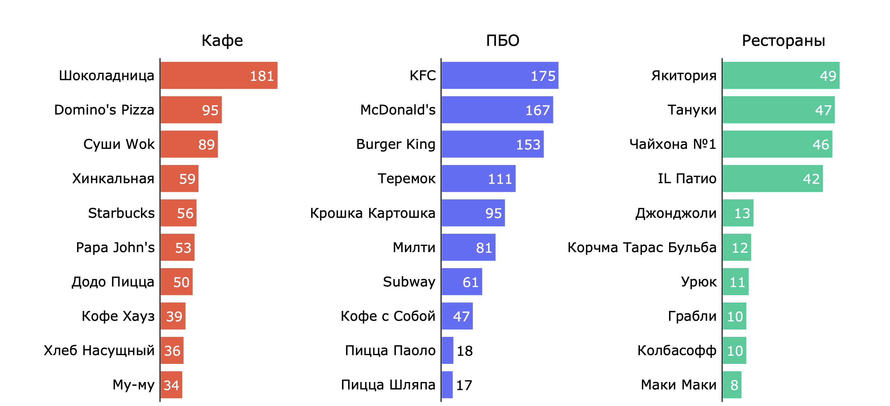

# Исследование рынка общественного питания Москвы

Данное исследование ставит перед собой цель по открытым данным проанализировать рынок заведений общественного питания Москвы.

<a href="https://rusmux.github.io/yandex-restaurants/" target="_blank">Исследование</a>

<a href="https://github.com/rusmux/yandex-restaurants/blob/main/Yandex.Restaurants.pdf" target="_blank">Презентация по исследованию</a>

В исследовании используются внешние данные, получение которых может суммарно занять до 60 минут. Для удобства эти данные были сохранены в файлах `google_data.csv` и `mapbox_data.csv`. Код для получения этих данных был закомментирован, для самостоятельного получения данных раскомментируйте его.

<h6 align="center">Распределение типов для сетевых и одиночных заведений</h6>

<h6 align="center">Топ-10 сетей по количеству заведений</h6>

 

<h6 align="center">Топ-10 самых популярных улиц по количеству заведений</h6>

**План:**

   <ul class="toc-item">
      <li><a href="#Setup" data-toc-modified-id="Setup-2">Setup</a></li>
      <li>
         <a href="#Предобработка-данных" data-toc-modified-id="Предобработка-данных-3">Предобработка данных</a>
         <ul class="toc-item">
            <li>
               <a href="#Обработка-адресов" data-toc-modified-id="Обработка-адресов-3.1">Обработка адресов</a>
               <ul class="toc-item">
                  <li><a href="#Google-geocoding" data-toc-modified-id="Google-geocoding-3.1.1">Google geocoding</a></li>
                  <li><a href="#Mapbox-reverse-geocoding" data-toc-modified-id="Mapbox-reverse-geocoding-3.1.2">Mapbox reverse geocoding</a></li>
               </ul>
            </li>
            <li><a href="#Обработка-названий-заведений" data-toc-modified-id="Обработка-названий-заведений-3.2">Обработка названий заведений</a></li>
            <li><a href="#Обработка-дубликатов" data-toc-modified-id="Обработка-дубликатов-3.3">Обработка дубликатов</a></li>
            <li>
               <a href="#Обработка-аномалий" data-toc-modified-id="Обработка-аномалий-3.4">Обработка аномалий</a>
               <ul class="toc-item">
                  <li><a href="#Сетевые-заведения" data-toc-modified-id="Сетевые-заведения-3.4.1">Сетевые заведения</a></li>
                  <li><a href="#Тип-заведения" data-toc-modified-id="Тип-заведения-3.4.2">Тип заведения</a></li>
                  <li><a href="#Количество-посадочных-мест" data-toc-modified-id="Количество-посадочных-мест-3.4.3">Количество посадочных мест</a></li>
               </ul>
            </li>
         </ul>
      </li>
      <li>
         <a href="#Исследовательский-анализ-данных" data-toc-modified-id="Исследовательский-анализ-данных-4">Исследовательский анализ данных</a>
         <ul class="toc-item">
            <li><a href="#Доля-сетей-на-рынке" data-toc-modified-id="Доля-сетей-на-рынке-4.1">Доля сетей на рынке</a></li>
            <li><a href="#Типы-заведений" data-toc-modified-id="Типы-заведений-4.2">Типы заведений</a></li>
            <li><a href="#Доля-сетей-по-типу-заведения" data-toc-modified-id="Доля-сетей-по-типу-заведения-4.3">Доля сетей по типу заведения</a></li>
            <li><a href="#Топ-сети" data-toc-modified-id="Топ-сети-4.4">Топ-сети</a></li>
            <li><a href="#Распределение-мест" data-toc-modified-id="Распределение-мест-4.5">Распределение мест</a></li>
            <li><a href="#Распределение-по-округам" data-toc-modified-id="Распределение-по-округам-4.6">Распределение по округам</a></li>
            <li><a href="#Распределение-по-улицам" data-toc-modified-id="Распределение-по-улицам-4.7">Распределение по улицам</a></li>
            <li><a href="#Местоположение-топ-сетей" data-toc-modified-id="Местоположение-топ-сетей-4.8">Местоположение топ-сетей</a></li>
         </ul>
      </li>
      <li><a href="#Итог" data-toc-modified-id="Итог-5">Итог</a></li>
   </ul>

 

**Выводы:**

Были даны открытые данные о заведениях общественного питания Москвы. Данные содержали множественные неточности и дубликаты, так что была проведена предобработка, которая включала в себя обработку названий заведений, типов объектов и адресов. Для получения точных адресов и координат объектов использовались сервисы Google Maps и Mapbox. 

&emsp; *Типы заведений*

* Кафе занимают ~40% рынка. Потом идут столовые (17%), рестораны (14%) и предприятия быстрого обслуживания (14%).   Остальные типы заведений составляют меньше 15% рынка.

&emsp; *Сети*

* Сетевые заведения составляют ~20% всех заведений. Практически 80% всего рынка занимают одиночные заведения.  Половина предприятий быстрого обслуживания являются сетями. Примерно четверть кафе и ресторанов - сети. Среди остальных типов заведений доля сетей незначительна.

* 52% всех сетей являются кафе; 
  32% являются ПБО; 
  14% являются ресторанами.
  
&emsp; *Топ-сети*

* Топ-сети обладают от 10 до 180 заведениями. Больше всего в среднем заведений у сетей предприятий быстрого обслуживания — от 60 до 170. У кафе немного меньше — от 40 до 100. Ресторанов обычно от 10 до 50.

&emsp; *Количество мест*

* В столовых и ресторанах порядка 80-100 сидячих мест; 
  В барах, буфетах и кафе – 30; 
  В ПБО относительно немного мест – меньше 10. 
  У самых популярных сетей в среднем по 15-50 мест. Но есть заведения и с малым количеством мест, а также заведения навынос.

&emsp; *Округа*

* По количеству заведений лидируют центральные округа Москвы. Особенно много заведений в Тверском и Пресненском округах.  Топ-10 округов занимают ~30% всего рынка. 

  Топ-7 округов:

&emsp;&emsp;&emsp; 1) Тверской 
&emsp;&emsp;&emsp; 2) Пресненский 
&emsp;&emsp;&emsp; 3) Басманный 
&emsp;&emsp;&emsp; 4) Даниловский 
&emsp;&emsp;&emsp; 5) Хамовники 
&emsp;&emsp;&emsp; 6) Таганский 
&emsp;&emsp;&emsp; 7) Мещанский 

* Самая низкая плотность заведений в подмосковных округах.

&emsp; *Улицы*

* На самых популярных улицах расположено от 80 до 170 заведений. 
  
  Топ-7 улиц (больше 100 объектов):
  
&emsp;&emsp;&emsp; 1) Профсоюзная улица 
&emsp;&emsp;&emsp; 2) Проспект Мира 
&emsp;&emsp;&emsp; 3) Варшавское шоссе 
&emsp;&emsp;&emsp; 4) Пресненская набережная 
&emsp;&emsp;&emsp; 5) Ленинградский проспект 
&emsp;&emsp;&emsp; 6) Проспект Вернадского 
&emsp;&emsp;&emsp; 7) Кировоградская улица 

**Рекомендации:**

<ins>Тип заведения:</ins> &ensp;**кафе** или **предприятие быстрого обслуживания**. 

В рестораны ходят уже взрослые, мало впечатлительные люди, которые новизне предпочитают скорость и качество. После того как угаснет ажиотаж вокруг новой технологии людям быстро докучит несговорчивый и мало эмоциональный "официант". Как правило, официант может с улыбкой рассказать про блюда, вина, ответить на вопросы и запомнить специфичные детали заказа. 

Железный официант мало впишется в бар по аналогичным причинам, а кафетерии и магазины мы не рассматриваем — это слишком редкий тип заведения. Столовые не являются сетевыми.

В кафе или предприятии быстрого обслуживания официант играет не такую существенную роль, как в ресторане. Если сделать роботов дружелюбными, то они вполне могут прийтись по душе детям в кафе, а в предприятии быстрого обслуживания они могут стать быстрыми и неназойливыми. Кроме того, кафе и ПБО — одни из самых частых типов заведений.

<ins>Количество мест:</ins> &ensp;**30-50**. В данном вопросе лучше довериться опыту. В среднем у топ-сетей кафе и ПБО от 30 до 60 сидячих мест. Можно начать с золотой середины — 40 мест, чтобы не создавать очень большую нагрузку в самом начале, но и не сокращать сильно места. Лучше сначала опробовать свои силы, а потом уже расширяться.

<ins>Округ:</ins> &ensp;любой **центральный округ**. Чтобы набрать популярность в первые месяцы, необходимо быть у людей на виду. Вряд ли сеть раскрутится в Одинцово. Дальше можно продолжить распространение равномерно по всей Москве, как у топ-сетей.

В моем представлении, это что-то похожее на Макдоналдс или Шоколадницу.

 

**Структура данных:**

Информация о заведениях общественного питания находится в файле `rest_data.csv`:

* `id` — уникальный идентификатор объекта;

* `object_name` — название заведения;

* `chain` — является ли заведение сетью;

* `object_type` — тип объекта;

* `address` — адрес заведения;

* `number` — количество посадочных мест.

Данные, полученные с помощью API Google Cloud Platform, сохранены в файле `google_data.csv`:

* `id` — уникальный идентификатор объекта;

* `google_address` — адрес заведения, полученный с помощью API Google Cloud Platform;

* `google_address_translated` — google-адрес, переведенный на русский через Google Переводчик;

* `latitude` — географическая ширина, полученная с помощью API Google Cloud Platform;

* `longitude` — географическая долгота, полученная с помощью API Google Cloud Platform.

Данные, полученные с помощью API Mapbox, сохранены в файле `mapbox_data.csv`:

* `id` — уникальный идентификатор объекта;

* `place` — регион/город заведения, полученный с помощью API Mapbox;

* `locality` — район, полученный с помощью API Mapbox;

* `street` — название улицы, полученное с помощью API Mapbox.

Названия заведений, переведенные на русский с помощью Google Переводчика, находятся в файле `object_names_translated.csv`:

* `id` — уникальный идентификатор объекта;

* `object_name` — название заведения, переведенное на русский с помощью Google Переводчика.
