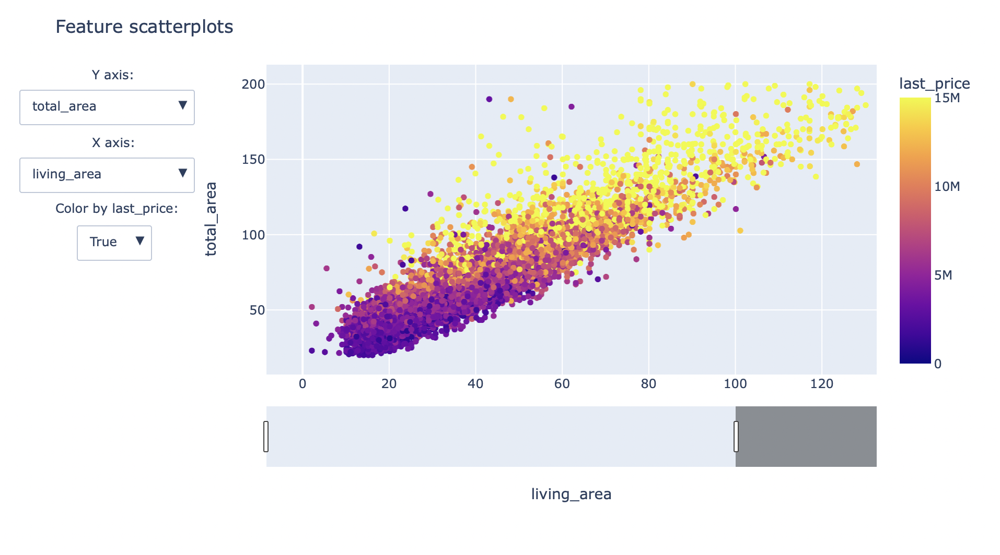
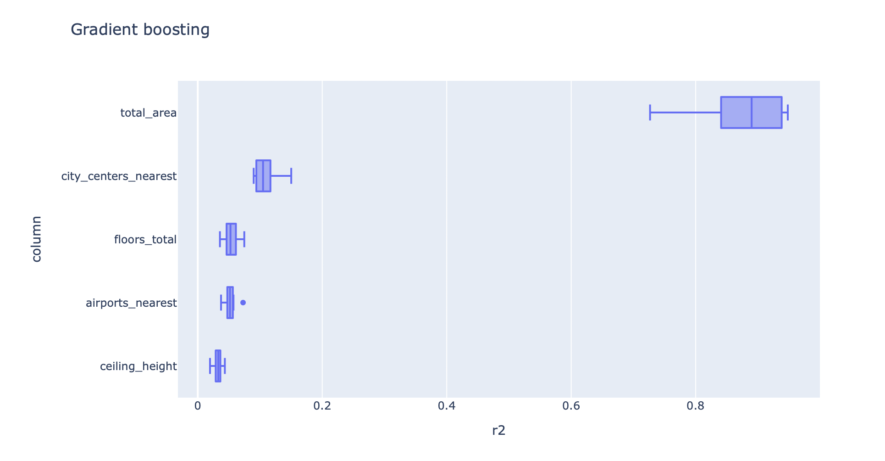
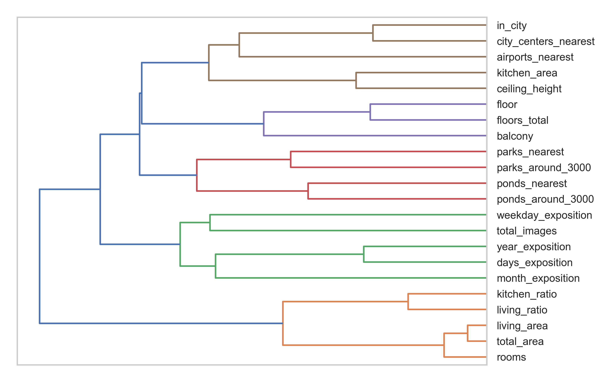

# Исследование объявлений о продаже квартир в Санкт-Петербурге

Данное исследование ставит перед собой цель определить, как различные характеристики квартиры влияют на ее конечную стоимость, и выявить среди них наиболее сильные признаки для будущей автоматизированной системы отслеживания аномалий и мошеннической деятельности.

Исследование основывается на архивных данных сервиса Яндекс.Недвижимость. По каждой квартире на продажу доступно два вида данных. Первые вписаны пользователем, вторые — получены автоматически на основе картографических данных. Например, расстояние до центра, аэропорта, ближайшего парка и водоёма.

[Исследование](https://rusmux.github.io/yandex-realty/)

[Jupyter-ноутбук](https://github.com/rusmux/yandex-realty/blob/main/Yandex.Realty.ipynb)

Ввиду большого веса ноутбук был сохранен без выводов.

 

<h6 align="center">Диаграмма рассеяния признаков</h6>

 

<h6 align="center">Результаты permutation-теста для модели градиентного бустинга</h6>

 

**План:**

   <ul class="toc-item">
      <li><a href="#Setup" data-toc-modified-id="Setup-2">Setup</a></li>
      <li><a href="#Вспомогательные-функции" data-toc-modified-id="Вспомогательные-функции-3">Вспомогательные функции</a></li>
      <li>
         <a href="#Предобработка-данных" data-toc-modified-id="Предобработка-данных-4">Предобработка данных</a>
         <ul class="toc-item">
            <li><a href="#Общее" data-toc-modified-id="Общее-4.1">Общее</a></li>
            <li><a href="#Удаление-столбцов" data-toc-modified-id="Удаление-столбцов-4.2">Удаление столбцов</a></li>
            <li>
               <a href="#Работа-с-пропусками-и-аномальными-значениями" data-toc-modified-id="Работа-с-пропусками-и-аномальными-значениями-4.3">Работа с пропусками и аномальными значениями</a>
               <ul class="toc-item">
                  <li><a href="#last_price" data-toc-modified-id="last_price-4.3.1">last_price</a></li>
                  <li><a href="#total_area" data-toc-modified-id="total_area-4.3.2">total_area</a></li>
                  <li><a href="#rooms" data-toc-modified-id="rooms-4.3.3">rooms</a></li>
                  <li><a href="#ceiling_height" data-toc-modified-id="ceiling_height-4.3.4">ceiling_height</a></li>
                  <li><a href="#floors_total" data-toc-modified-id="floors_total-4.3.5">floors_total</a></li>
                  <li><a href="#living_area" data-toc-modified-id="living_area-4.3.6">living_area</a></li>
                  <li><a href="#kitchen_area" data-toc-modified-id="kitchen_area-4.3.7">kitchen_area</a></li>
                  <li><a href="#balcony" data-toc-modified-id="balcony-4.3.8">balcony</a></li>
                  <li><a href="#airports_nearest" data-toc-modified-id="airports_nearest-4.3.9">airports_nearest</a></li>
                  <li><a href="#city_centers_nearest" data-toc-modified-id="city_centers_nearest-4.3.10">city_centers_nearest</a></li>
                  <li><a href="#parks_around_3000" data-toc-modified-id="parks_around_3000-4.3.11">parks_around_3000</a></li>
                  <li><a href="#ponds_around_3000" data-toc-modified-id="ponds_around_3000-4.3.12">ponds_around_3000</a></li>
                  <li><a href="#parks_nearest" data-toc-modified-id="parks_nearest-4.3.13">parks_nearest</a></li>
                  <li><a href="#ponds_nearest" data-toc-modified-id="ponds_nearest-4.3.14">ponds_nearest</a></li>
                  <li><a href="#days_exposition" data-toc-modified-id="days_exposition-4.3.15">days_exposition</a></li>
               </ul>
            </li>
         </ul>
      </li>
      <li>
         <a href="#Отбор-признаков" data-toc-modified-id="Отбор-признаков-5">Отбор признаков</a>
         <ul class="toc-item">
            <li><a href="#Общее" data-toc-modified-id="Общее-5.1">Общее</a></li>
            <li><a href="#locality_name" data-toc-modified-id="locality_name-5.2">locality_name</a></li>
            <li><a href="#first_day_exposition" data-toc-modified-id="first_day_exposition-5.3">first_day_exposition</a></li>
            <li><a href="#floor" data-toc-modified-id="floor-5.4">floor</a></li>
            <li><a href="#Отбор-признаков-с-sklearn" data-toc-modified-id="Отбор-признаков-с-sklearn-5.5">Отбор признаков с sklearn</a></li>
            <li><a href="#Вывод" data-toc-modified-id="Вывод-5.6">Вывод</a></li>
            <li><a href="#Отбор-признаков-в-центральной-части-Санкт-Петербурга" data-toc-modified-id="Отбор-признаков-в-центральной-части-Санкт-Петербурга-5.7">Отбор признаков в центральной части Санкт-Петербурга</a></li>
         </ul>
      </li>
   </ul>

 

**Итог:**

На удивление, отбор признаков с помощью различных моделей показал, что существенный вес несут не те признаки, которые можно было бы ожидать исходя из диаграмм рассеяния и корреляции. Несмотря на высокую корреляцию с ценой, ни одна модель не посчитала столбец `living_area` весомым. Зато значимым стал столбец `ponds_around_3000`. На самом деле, это неудивительно, потому что большинство признаков несут одну и ту же информацию. Например, столбцы `total_area`, `living_area`, `kitchen_area` и `rooms` взаимосвязаны и несут похожую информацию. А вот столбец `city_centers_nearest` уникален.

В целом, главными признаками можно выделить `total_area`, `city_centers_nearest`, `airports_nearest`, `ceiling_height`, `kitchen_area` и `rooms`. Столбец `floors_total` несильно помогает улучшить оценку, а `rooms` лишь немного улучшает результат столбцов `total_area` и `kitchen_area`. Столбец `living_area` практически не вносит ни какой новый вклад.

Остальные признаки, такие как `floor`, `balcony` и `ponds_around_3000` влияют лишь на очень малое количество квартир - меньше 5%. Параметр `in_city` скорее всего просто дублирует `city_centers_nearest`, и его выбрала только линейная регрессия, вероятно, потому что она не может сравнить `city_centers_nearest > 20000`, а так как деревья могут выявлять нелинейности, то этот параметр для них был неважен. 

<h6 align="center">Дендограмма признаков</h6>

 

**Структура данных:**

Данные Яндекс.Недвижимости о недвижимости в Санкт-Петербурге находятся в файле `realty_data.csv`:

* `total_images` — число фотографий квартиры в объявлении

* `last_price` — цена на момент снятия публикации

* `total_area` — общая площадь квартиры в квадратных метрах

* `first_day_exposition` — дата публикации

* `rooms` — число комнат

* `ceiling_height` — высота потолков в метрах

* `floors_total` — всего этажей в доме

* `living_area` — жилая площадь в квадратных метрах

* `floor` — этаж

* `is_apartment` — является ли апартаментами (да/нет)

* `studio` — является ли студией (да/нет)

* `open_plan` — свободная планировка (да/нет)

* `kitchen_area` — площадь кухни в квадратных метрах

* `balcony` — число балконов

* `locality_name` — название населённого пункта

* `airports_nearest` — расстояние до ближайшего аэропорта в метрах

* `cityCenters_nearest` — рассторяние до ближайшего торгового центра в метрах

* `parks_around3000` — количество парков в радиусе 3 км

* `parks_nearest` — расстояние до ближайшего парка в метрах

* `ponds_around3000` — количество водоёмов в радиусе 3 км

* `ponds_nearest` — расстояние до ближайшего водоёма в метрах

* `days_exposition` — количество дней от публикации до снятия
